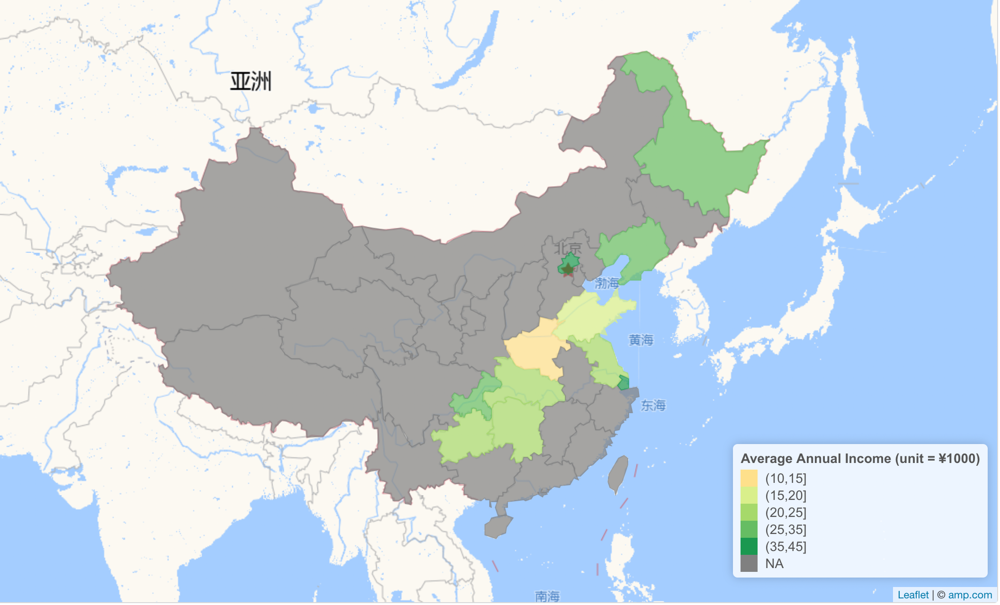

<!-- README.md is generated from README.Rmd. Please edit that file -->

# CHNS R package 

<!-- badges: start -->

[](https://lifecycle.r-lib.org/articles/stages.html#experimental)
[](https://CRAN.R-project.org/package=surveyjanitor)
[](https://github.com/jwu13/CHNS/actions/workflows/R-CMD-check.yaml)

<!-- badges: end -->

## Summary

Our package helps researchers explore [China Health and Nutrition
Survey](https://www.cpc.unc.edu/projects/china/data) With just a basic
knowledge of R, the users can access a wide variety of information
regarding effects of the health, nutrition, and family planning policies
on the health and nutritional status of its population.  

The package includes two data set that includes individual-level survey
data of 10 specific years over the period of 1989 - 2015.  

There are currently three functions inside the package:  

-   `real_income`: takes in a numeric year value and returns a data
    frame with real income adjusted for inflation.  

-   `num_of_children`: takes in a numeric year value and returns a data
    frame with child births, child deaths, and total children up to the
    input year.  

-   `map_income`: takes in a numeric year value and returns a map of
    China with province-level average annual income mapped on the
    surveyed provinces.  

This package would be a useful tool for social science researchers
interested in policy analysis in China. Additionally, it is also an easy
tool for data analysis and visualization for anyone interested in CHNS.

## Installation

You can install the development version of CHNS from
[Github](https://github.com/jwu13/CHNS) with:

``` r
devtools::install_github("jwu13/CHNS")
```

You can load this package by

``` r
library(chns)
```

For `map_income()` function in the package, you need to install and load
the package leafletCN.

``` r
install.packages("leafletCN")
library(leafletCN)
```

## Data Sets Included

-   `indinc_10_clean`: A data set that includes 88166 survey data
    entries from 1989 - 2015 with Individual ID, survey year, and
    nominal individual income.
-   `emw_12_clean`: A data set that includes 26616 survey data entries
    from 1989 - 2015 with Individual ID, survey year, number of child
    died and number of child births for women.
-   `map_dat_clean`: A simple data set with province-level average
    annual income, survey year, province names in both English and
    Chinese, and categories of income that is used for mapping.

### Basic usage of functions

-   Example 1: Calculate the real income

This is a basic example for `real_income()` that returns a data frame
with income weighted with CPI for the selected base year.

``` r
real_income(base_year=1989) 
#> # A tibble: 88,166 × 5
#>           IDind  wave indwage annual_wage_CPI  base
#>           <dbl> <dbl>   <dbl>           <dbl> <dbl>
#>  1 211103001001  1989   1140.           1140.  1989
#>  2 211103001002  1989    940.            940.  1989
#>  3 211103002001  1989   1590.           1590.  1989
#>  4 211103002002  1989    229.            229.  1989
#>  5 211103003003  1989    784.            784.  1989
#>  6 211103003004  1989    784.            784.  1989
#>  7 211103004003  1989    940.            940.  1989
#>  8 211103004004  1989    784.            784.  1989
#>  9 211103005001  1989   1140.           1140.  1989
#> 10 211103005002  1989    784.            784.  1989
#> # … with 88,156 more rows
```

-   Example 2: Calculate Number of Children a Women has

This is an example for `num_of_children()` that returns a data frame
with number of child births, number of child deaths, and number of total
children of women included in the dataset up to the input year.

``` r
num_of_children(year = 2006) 
#> # A tibble: 17,948 × 5
#>           IDind  wave child_died child_births num_children
#>           <dbl> <dbl>      <dbl>        <dbl>        <dbl>
#>  1 211101001002  1991          0            0            0
#>  2 211101001002  1993          0            0            0
#>  3 211101001002  2000          0            1            1
#>  4 211101002002  1991          0            0            0
#>  5 211101002002  1993          0            1            1
#>  6 211101003002  1991          0            0            0
#>  7 211101003002  1993          0            1            1
#>  8 211101003002  2000          0            1            1
#>  9 211101003101  2006          0            1            1
#> 10 211101004001  1991          0            0            0
#> # … with 17,938 more rows
```

### Data Visualization

-   Example 3: Get a map to get an overview of province-level average
    income.



``` r
map_income(year = 2011)
```

## Group Members

-   [Junru Wu](https://github.com/jwu13)
-   [Betty Pu](https://github.com/bettyjpu)
